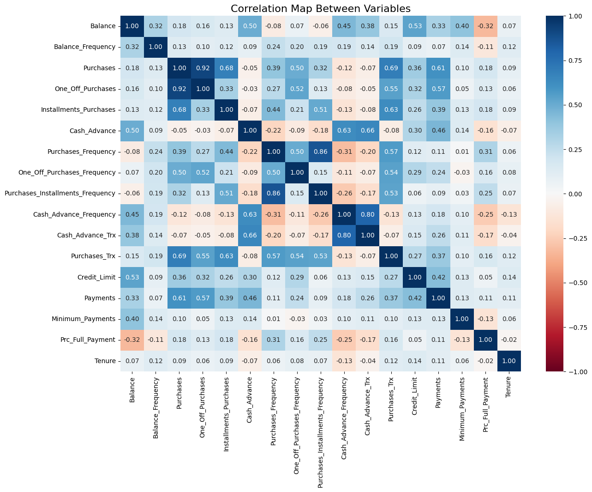
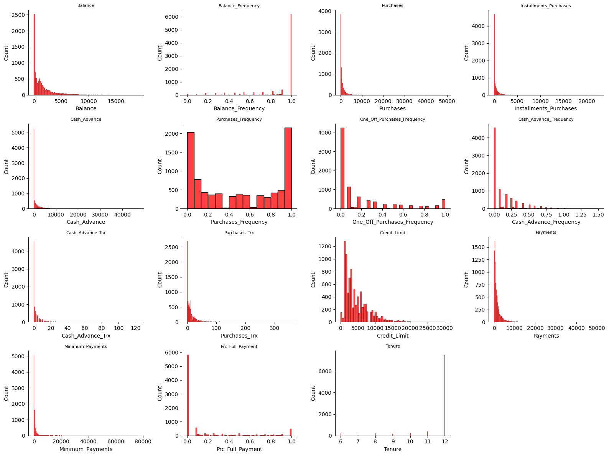
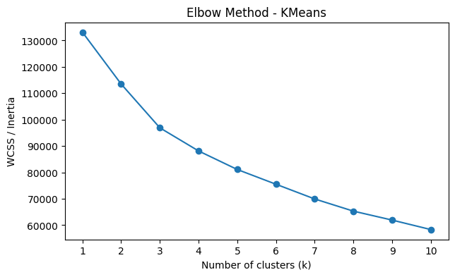
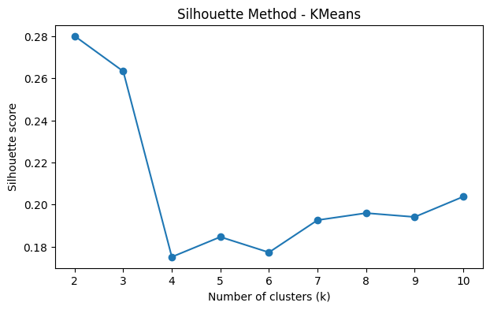
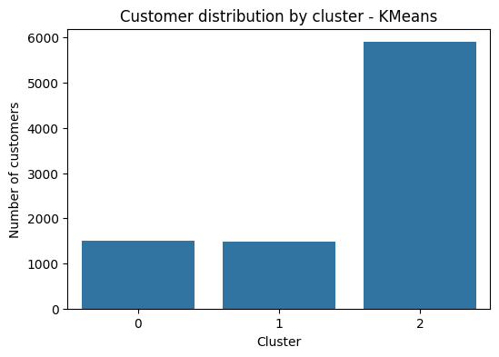
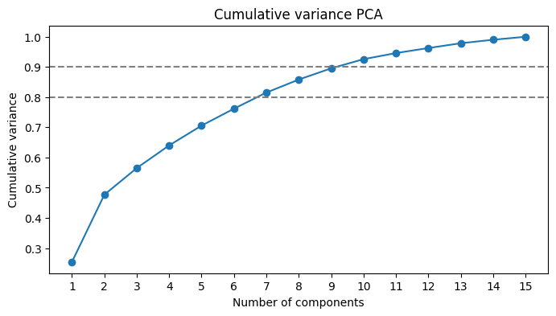
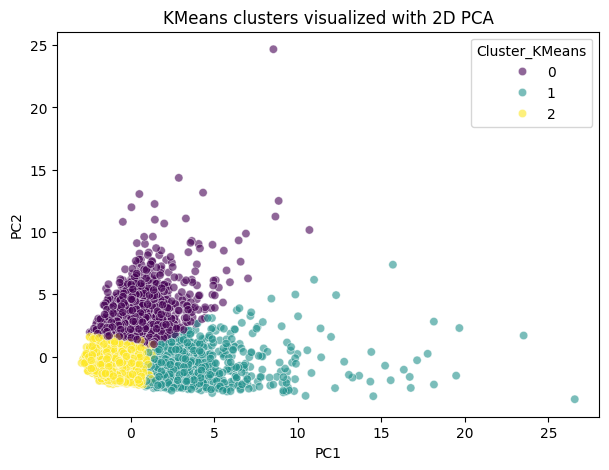
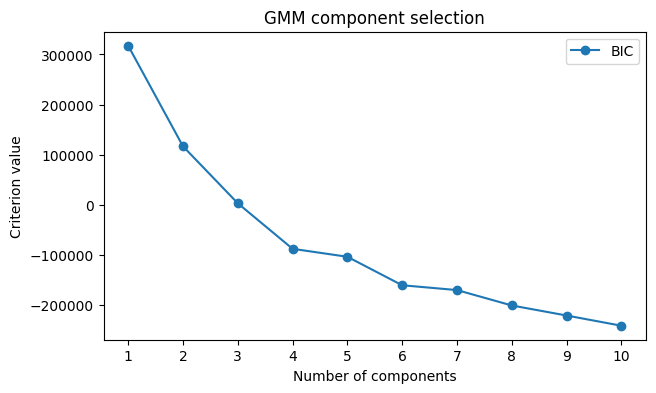
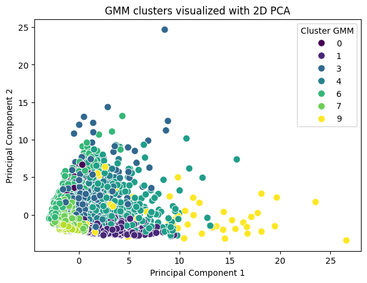

# Credit Card Customer Segmentation

This repository contains a customer segmentation project based on a public credit card customer dataset. The analysis is developed in a Jupyter notebook and focuses on unsupervised learning methods for behavioral segmentation.

## Important note about figures

All figures shown in this README were extracted directly from the executed outputs of the notebook:

`notebooks/credit_card_customer_segmentation.ipynb`

No external, manually redrawn, or invented plots were added to this repository. The complete traceability of each image is available in:

`assets/figures/FIGURE_INDEX.md`

## Repository structure

```text
.
├── assets/
│   ├── figures/   # PNG figures extracted from the notebook outputs
│   └── tables/    # Data preview and column summary created from the CSV
├── data/
│   └── Customer_Data.csv
├── notebooks/
│   └── credit_card_customer_segmentation.ipynb
├── scripts/
│   └── extract_notebook_figures.py
├── src/
│   └── preprocessing.py
├── METHODOLOGY.md
├── README.md
├── requirements.txt
└── .gitignore
```

## Dataset

The dataset is included in `data/Customer_Data.csv` so the notebook can be executed directly after cloning the repository. A first preview of the data is available in `assets/tables/data_preview_first_10_rows.csv`.

## Methods covered in the notebook

- Exploratory data analysis
- Missing value inspection and treatment
- Standardization of numerical variables
- K-Means clustering
- Elbow method and silhouette analysis
- Principal Component Analysis for visualization
- Gaussian Mixture Models
- Exploratory Factor Analysis
- Cluster interpretation based on customer behavior

## Main figures from the notebook

### Correlation Map Between Variables

Extracted from the notebook output where the correlation matrix is plotted with `sns.heatmap`. It summarizes how the numerical variables move together.



### Distribution Visualization

Extracted from the notebook histogram block. It shows the distribution of the project variables.



### K-Means Validation: Elbow Method

Extracted from the K-Means validation section of the notebook.



### K-Means Validation: Silhouette Method

Extracted from the K-Means validation section of the notebook.



### K-Means Cluster Distribution

Extracted from the final K-Means model section.



### PCA Cumulative Variance

Extracted from the PCA section of the notebook.



### K-Means Clusters in 2D PCA

Extracted from the PCA visualization section.



### GMM Component Selection

Extracted from the Gaussian Mixture Model section.



### GMM Clusters in 2D PCA

Extracted from the Gaussian Mixture Model section.



## How to run

```bash
pip install -r requirements.txt
jupyter notebook notebooks/credit_card_customer_segmentation.ipynb
```

The notebook uses a portable dataset path and looks for the CSV inside the `data/` folder.

## Reproducibility

The script `scripts/extract_notebook_figures.py` can be used to re-extract the image outputs from the notebook if the notebook is re-executed.

## Author

Jhosmel Mateo
