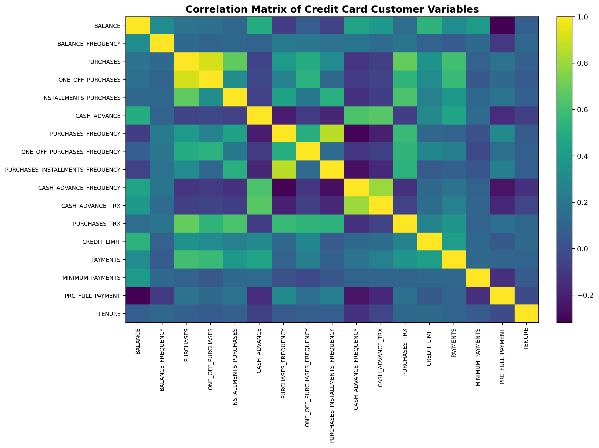
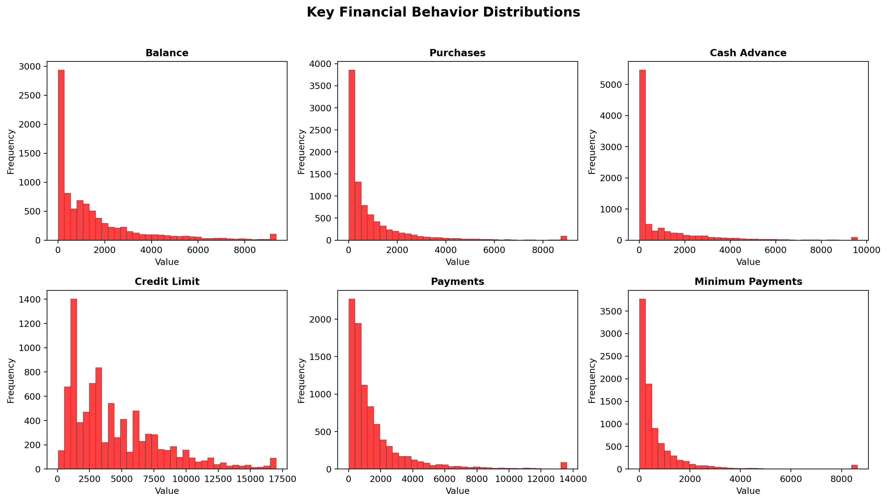
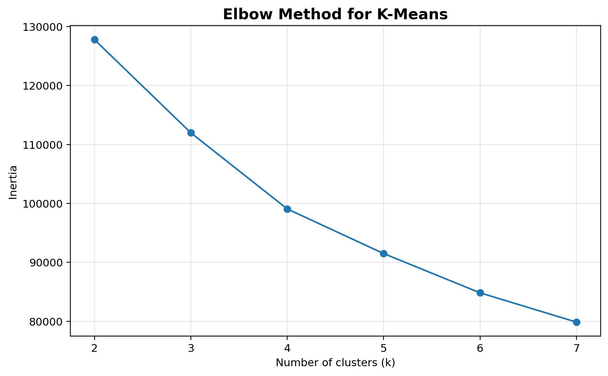
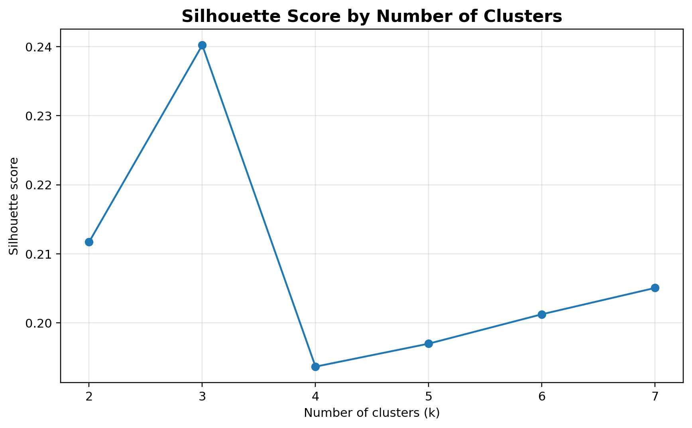
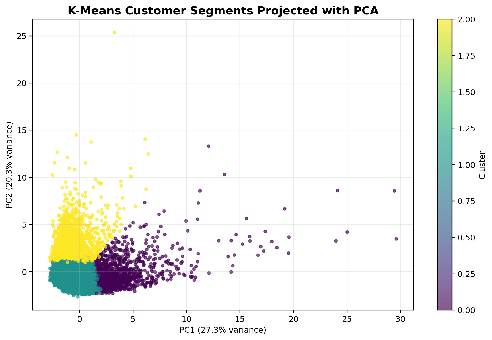
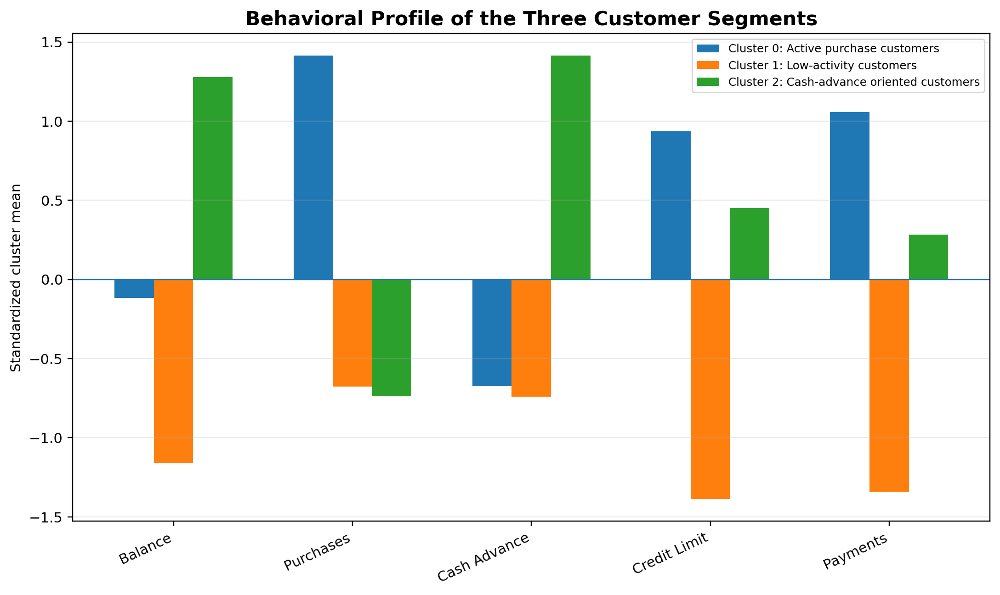
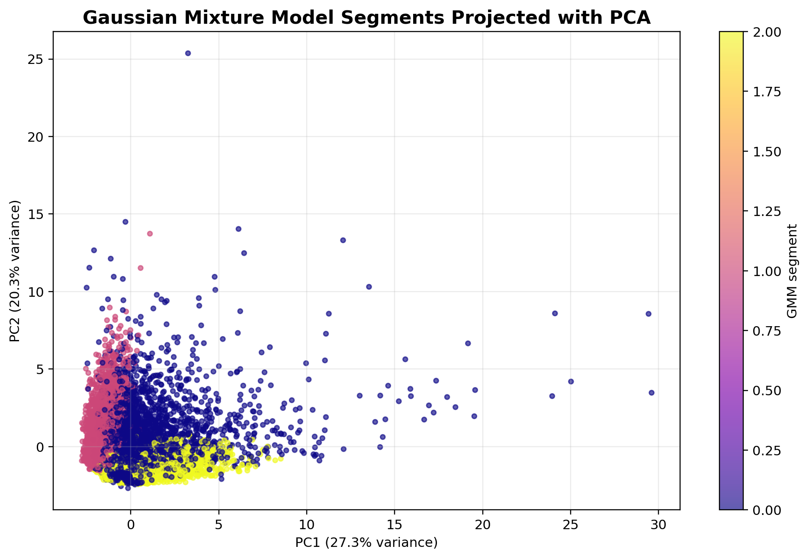

# Credit Card Customer Segmentation


This repository presents a complete **data science customer segmentation project** using a public credit card customer dataset. The objective is to identify meaningful behavioral groups using unsupervised learning and to explain the business meaning of each segment.

Unlike a basic clustering notebook, this project includes a structured workflow, detailed interpretations for the main tables and graphs, and a comparison of different unsupervised methods.

## Project objective

The main goal is to segment credit card customers according to their financial behavior, including balance, purchases, cash advances, payments, credit limit, transaction frequency, and full payment behavior.

## Repository structure

```text
credit-card-customer-segmentation/
├── assets/
│   ├── figures/          # Main result graphs for GitHub visualization
│   └── tables/           # Model metrics, cluster profile and data preview
├── data/
│   └── Customer_Data.csv # Public dataset used in the analysis
├── notebooks/
│   └── credit_card_customer_segmentation.ipynb
├── src/
│   └── preprocessing.py
├── METHODOLOGY.md
├── README.md
├── requirements.txt
└── .gitignore
```

## Dataset

The dataset contains **8,950 credit card customers** and **18 variables**. It includes behavioral indicators related to purchases, balance, credit limits, payments, cash advances and payment habits.

A short data preview is available in [`assets/tables/data_preview.csv`](assets/tables/data_preview.csv), and the full dataset is included in [`data/Customer_Data.csv`](data/Customer_Data.csv) for reproducibility.

## Methods used

- Exploratory Data Analysis
- Missing value treatment
- Feature scaling with `StandardScaler`
- K-Means clustering
- Elbow method and silhouette score
- Principal Component Analysis
- Gaussian Mixture Models
- Exploratory Factor Analysis
- Cluster interpretation based on financial behavior

## Main visual results

### Correlation structure

The correlation matrix helps identify groups of variables that move together, such as purchases, transaction frequency and payments.



### Key variable distributions

The histograms show that several financial variables are highly right-skewed. This is common in customer behavior datasets because a small group of customers tends to concentrate high balances, purchases or cash advances.



### Choosing the number of clusters

The elbow method and silhouette score are used to support the choice of a three-cluster solution.





### PCA visualization of K-Means clusters

PCA is used to visualize the customer groups in a lower-dimensional space. The model is trained on standardized variables, and PCA is used mainly for interpretation and visualization.



### Behavioral profile of the segments

The cluster profile summarizes the differences between the customer groups using standardized average values.



### GMM comparison

Gaussian Mixture Models are included as an additional probabilistic clustering approach to compare whether the segmentation pattern remains stable under another method.



## Main customer segments

| Cluster | Segment interpretation | Customers | Share |
|---:|---|---:|---:|
| 0 | Active purchase customers | 1275 | 14.25% |
| 1 | Low-activity customers | 6114 | 68.31% |
| 2 | Cash-advance oriented customers | 1561 | 17.44% |


## Model summary

| Metric | Value |
|---|---:|
| Silhouette score (sample=1000) | 0.2402 |
| Calinski-Harabasz index | 1605.03 |
| Davies-Bouldin index | 1.592 |
| PCA variance PC1 | 0.273 |
| PCA variance PC2 | 0.2031 |
| PCA variance PC3 | 0.0881 |
| PCA variance PC1-PC3 | 0.5642 |


## How to run the project

1. Clone the repository.
2. Install dependencies:

```bash
pip install -r requirements.txt
```

3. Open the notebook:

```bash
jupyter notebook notebooks/credit_card_customer_segmentation.ipynb
```

4. Run all cells.

The notebook uses a portable path, so it will automatically look for the dataset inside `data/Customer_Data.csv`.

## Notes on originality

This project uses a public dataset, which means other projects may analyze the same data. The originality of this repository comes from the analytical structure, expanded interpretation, methodological comparison, and professional documentation of the results.

## Author

**Jhosmel Mateo**  
Data Science Portfolio Project
